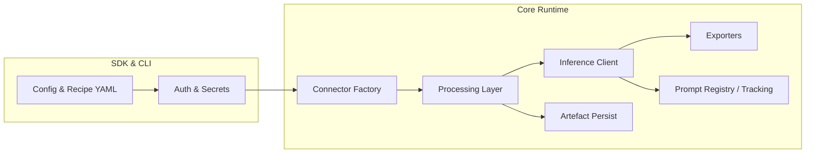

# Frontier Model Framework – Architecture Deep Dive

## Repository Layout
| Path | Role | Notes |
|------|------|-------|
| `src/fmf/cli.py` | CLI entrypoint | Subcommands for keys/connect/process/prompt/run/infer/export/recipe |
| `src/fmf/sdk/` | Python SDK facade | `FMF` client + `run_recipe_simple` helper for thin orchestrators |
| `src/fmf/chain/` | Chain loader/runner | Orchestrates connector → processing → inference → exporters |
| `src/fmf/core/` | Shared interfaces & utilities | Typed specs (`ConnectorSpec`, `RunContext`), error taxonomy, retry helpers shared across layers |
| `src/fmf/connectors/` | Data connectors | Local, S3, SharePoint implementations |
| `src/fmf/processing/` | Document loaders & chunkers | Text/table/image normalization + persistence |
| `src/fmf/inference/` | Provider adapters | Azure OpenAI, AWS Bedrock, provider registry |
| `src/fmf/exporters/` | Export sinks | S3, DynamoDB, Delta, SharePoint Excel, Redshift, Fabric |
| `src/fmf/rag/` | Retrieval pipelines | Builds & records retrieval artefacts per pipeline |
| `examples/recipes/*.yaml` | Declarative recipes | Thin orchestrator scripts reference these configs |
| `scripts/*.py` | Recipe orchestrators | Call `run_recipe_simple` for CSV, images, text, Fabric |

### Extension Points
- **Connectors**: inherit `BaseConnector` and register via `connectors/__init__.py`. Legacy helpers in `connectors/base.py` (e.g., `ResourceRef`) remain available for backwards compatibility during migration.
- **Processing**: pluggable chunking/loader utilities selected by MIME/extension.
- **Inference providers**: implement `BaseProvider` or adapter; register in `inference/registry.py`.
- **Exporters**: implement `Exporter` protocol; instantiated from `exporters/__init__.py` factory.
- **Recipes/Chains**: YAML-driven flows referencing connectors, processing options, prompts, exporters.

## Runtime Data Flow

### High-Level Sequence
1. **Configuration** – `fmf.yaml` + CLI/ENV overrides feed `load_config` → typed models.
2. **Auth & Keys** – Provider-specific secret resolution via env/Azure KV/AWS Secrets.
3. **Connector selection** – `build_connector` instantiates source (filesystem, S3, SharePoint) and enumerates resources using include/exclude patterns.
4. **Processing** – `processing.loaders` normalises files (text, tables, images). `chunking` generates token-aware chunks, metadata persisted under `artefacts/<run_id>/`.
5. **Inference** – `chain.runner` builds messages, invokes `build_llm_client` (Azure/Bedrock adapters) with retry/backoff + optional streaming.
6. **RAG (optional)** – `rag.pipeline` builds retrieval cache; results injected into prompts and logged.
7. **Export** – Chain outputs saved locally (`outputs.jsonl`, manifests) and optionally sent to sinks (S3/Delta/DynamoDB/etc.) via exporter contracts.
8. **Observability** – Structured logging + metrics, optional OpenTelemetry spans; run metadata recorded in `run.yaml`.

## Entry Points
- CLI (`python -m fmf ...`) with subcommands, JSON summaries via `--emit-json-summary`.
- SDK (`from fmf.sdk import FMF, run_recipe_simple`) enabling orchestration scripts and integrations.
- Scripts (`scripts/*.py`) serving as thin wrappers around recipes.

## Cross-Cutting Concerns
- **Error taxonomy** – `fmf/core/errors.py` defines domain-specific exceptions; CLI maps to exit codes.
- **Idempotency** – `processing.persist` + deterministic IDs (`core/ids.py`) support reproducible runs.
- **Configuration Profiles** – `fmf.yaml` supports profiles (local/aws_lambda/aws_batch) and env/CLI overrides.
- **Artefact Tracking** – Each run writes manifests, chunks, outputs for audit / replay.
