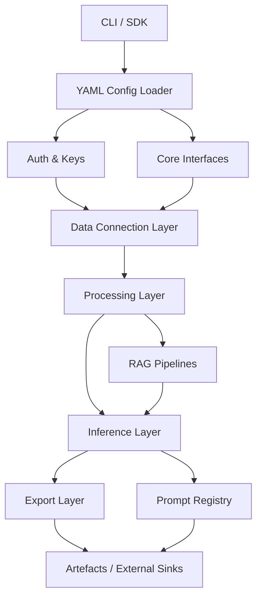

# Frontier Model Framework – Architecture Audit

Short summary: FMF is organised around YAML-driven runs that fan through connectors, processors, inference providers, and exporters. A new `core/interfaces` module captures minimal contracts so each layer can be swapped independently.

Layer boundaries:
- **Config/Auth:** YAML-first configs elevated via `load_config`; secrets resolved through pluggable providers (env, Azure Key Vault, AWS Secrets Manager).
- **Data connectors:** Local, S3, SharePoint adapters follow `ResourceRef`/`ResourceInfo`; streaming reads but missing retries/backoff.
- **Processing:** Document loaders, chunkers, tables, and OCR feed `Document`/`Chunk` types with artefacts persisted under `artefacts/<run_id>/`.
- **Inference:** Unified `LLMClient` wraps Azure OpenAI & Bedrock with retry helper; new `ModelSpec` contract describes capabilities and pricing metadata.
- **Export:** Exporters serialise outputs to S3, SharePoint Excel, DynamoDB, Delta, Redshift with unified `ExportSpec`.
- **Prompt Versioning / RAG:** Git-backed prompts with explicit versions; RAG pipelines iterate over connectors and persist retrieval artefacts for auditability.
